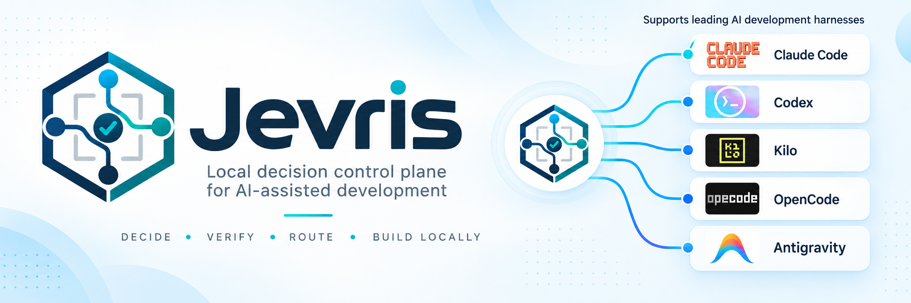
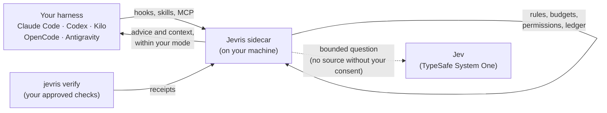

<div align="center">



**Decide · Verify · Route · Build locally**

[](https://github.com/CryptVenture/Jevris/actions/workflows/ci.yml)
[](https://github.com/CryptVenture/Jevris/actions/workflows/codeql.yml)
[](https://www.npmjs.com/package/@webventures/jevris)
[](docs/installation.md)
[](LICENSE)

[Quick start](#quick-start) · [Jevris in simple terms](docs/jevris-in-simple-terms.md) · [Documentation](docs/README.md) · [CLI reference](docs/cli.md) · [Changelog](CHANGELOG.md)

</div>

# Jevris

A local decision control plane for AI-assisted development.

Jevris sits beside your coding harness (Claude Code, Kilocode, Codex, OpenCode or Antigravity). Facts, arithmetic, permissions and verification stay in deterministic software. Jev (TypeSafe System One) is asked only bounded questions: pick one of these, score this, say "none of the above". Code generation stays with your coding model. Work counts as done only when independent evidence says so.

New to Jevris? Start with [Jevris in simple terms](docs/jevris-in-simple-terms.md): what it does and does not do, what it costs, and whether it suits your workflow.

## How it fits together



Everything except the dotted call to Jev runs on your machine. Without a Jev key, Jevris runs rules-only: it still observes, verifies and advises from its rules.

## Quick start

> [!NOTE]
> Version 1.2.0 is a release candidate. It is not on the npm registry yet (see [RELEASING.md](RELEASING.md)). Until the release, install from a checkout.

```sh
git clone https://github.com/CryptVenture/Jevris.git
cd Jevris
npm ci --ignore-scripts   # prebuilt native modules: no C++ toolchain needed
npm rebuild esbuild       # the one install script a dependency needs
npm run build
node bin/jevris.mjs --version
node bin/jevris.mjs install --dry-run     # print every change it would make; change nothing
node bin/jevris.mjs install --yes         # install into all five harnesses (or --harness), then certify them (no model call)
jevris doctor                             # what works on this machine, and what does not (✓ works, i by design, ! fix, ✗ failed)
```

After the release, the same steps need no clone and no build:

```sh
npx @webventures/jevris --version
npx @webventures/jevris install --dry-run
npx @webventures/jevris install --yes
npx @webventures/jevris doctor
```

Install also puts a `jevris` command on your PATH (`~/.local/bin/jevris`, or `%LOCALAPPDATA%\Jevris\bin\jevris.cmd` on Windows). If that folder is not on your PATH, an interactive install asks once before adding it to your shell profile, and otherwise prints the line to add; `jevris uninstall` removes it again. After the release you can also install the command globally:

```sh
npm i -g @webventures/jevris
jevris --help
```

`--home` is optional: it defaults to `JEVRIS_HOME`, then to your home directory, and every command prints the home it used. Install copies a versioned runtime into the Jevris data folder and points each harness there, so clearing the npm cache never breaks an installed harness. Full steps, including Windows and source installs: [docs/installation.md](docs/installation.md).

## Requirements

| | Supported |
| --- | --- |
| Node.js | `^22.14.0 \|\| >=23.6.0` (Node-API 10 or later). Older Node exits with one plain line. |
| Operating systems | macOS, Linux, Windows |
| Architectures | x64, arm64 |
| Native modules | better-sqlite3 and @napi-rs/keyring ship prebuilt binaries for these; no compiler is needed. |
| Harnesses | Claude Code, Kilocode, Codex, OpenCode and Antigravity, each signed in with a subscription or an API key (Antigravity with its Google sign-in only) |

Which harness, version and operating system combinations are *certified* is listed in [docs/platform-support.md](docs/platform-support.md), generated from signed certification records. A record covers a range of harness versions. A harness upgraded past that range, or a feature that real use showed misbehaving, is re-checked in the background with no model call (started by `jevris doctor`, the sidecar's start or a SessionStart), so a routine upgrade needs no re-certification by hand.

## What it does

| Command | What you get |
| --- | --- |
| `status` | Mode, sidecar state, recent decisions, budget and kill switch |
| `plan` | Task-graph validation: waves, critical path, ready tasks, write-scope conflicts |
| `route` | Model and effort advice for the main session and managed workers; never switches your session's model or overrides a pinned one. `route learning` shows and controls per-workspace learning for owned workers. |
| `checkpoint` | A memory capsule of constraints and changed files; never triggers compaction |
| `recover` | One allow-listed recovery action for repeated or environment failures |
| `verify` | Runs the checks you approved and reports whether the work is verified |
| `explain` | A factual trace of one decision |
| `configure` | Product settings; never native harness permissions |

The same eight commands are available as skills and MCP tools inside your harness, plus a ninth skill, `guide`, a short tour of what Jevris does and where the docs are. More public commands: `evidence`, `task`, `cost-report`, `feedback`, `delivery`, `integrate`, `advise`, `budget`, `control` and `handoff`. Administration: `install`, `uninstall`, `doctor`, `certify`, `sidecar`, `service`, `kill-switch`, `store`, `audit`, `authorize`, `credential`, `egress`, `consent`, `data` and `pack`, plus the operator tools `policy`, `gates`, `shadow` and `shortlist`. Every command and flag: [docs/cli.md](docs/cli.md).

**Model routing.** Opus 5.5 is the baseline model. Route advice covers the model and its effort level. For owned workers (the harness runs Jevris starts itself to do a leased task), route learning learns per workspace from verified outcomes. Version 1.2 ships no signed baseline, so every slice starts on Opus 5.5 at medium effort and switches only after 12 of the workspace's own outcomes on each arm, with owner-locked thresholds, fast automatic demotion and your pins always winning. Owned workers run in all five harnesses; routing acts only on a harness certified for it and otherwise advises. Costs follow each harness's sign-in: dollars on an API key, usage-limit consumption on a subscription. See [docs/routing.md](docs/routing.md).

## What it does not do (enforcement, honestly)

- **One setting caps everything.** `mode` is `off`, `observe`, `advise` or `bounded-auto` (the default). Raising it needs a person at a terminal; lowering it never asks. See [docs/settings.md](docs/settings.md#modes).
- **Installed is not enforced.** A harness hook or plugin that Jevris registers acts only where a signed certification record covers that harness, its version and your operating system, and only as far as `mode` allows: adding context needs `advise`, choosing a model or starting a worker needs `bounded-auto`. Without one, `doctor` reports the feature as `unsupported` or `reduced`, and Jevris only observes and advises there.
- **Your harness permissions stay in charge.** Jevris never grants a permission, never widens a sandbox and never answers a permission prompt for you. The most it may do on a certified actuator is add context, or in Claude Code and Codex choose a subagent's model. Codex applies a rewritten `spawn_agent` call only with an `allow` answer, so there, and only there, Jevris answers `allow` with the call's own input plus `model`; certify first checks that the subagent still gets the parent's approval policy and sandbox. It proposes one only with evidence for that subagent type and never over an explicit model or a pin; in 1.2, with no subagent evidence yet, it abstains in practice and the subagent keeps the harness's choice. It never allows what your harness would block. An owned worker gets only the tools its task was granted.
- **No source leaves your machine without consent.** Source egress is denied until a person approves it at a terminal (`jevris egress approve`), and a managed or organization policy that denies it wins. A repository file, a prompt or a model summary is not consent.
- **Secrets stay in the OS keychain.** The Jev key is read from standard input into the macOS Keychain, Windows Credential Manager or Linux Secret Service. It never appears in arguments, logs or config files. On headless Linux, CI or WSL you may opt in to an owner-only key file or a systemd credential instead. Without a key Jevris runs rules-only.
- **Your harness logins stay yours.** Jevris records only whether a harness runs on a subscription or an API key, never a key or a token. The Claude Agent SDK runs only with an API key; a claude.ai login is used only by your own Claude Code.
- **Installs are reversible.** Every file Jevris changes is backed up first. Other tools' settings in shared config files are kept byte for byte, and `uninstall` removes only what Jevris added.
- **No speed or cost claims.** Release gates judge quality and economics only on measured, signed evidence. Vendor claims are not Jevris results.

The kill switch (`jevris kill-switch activate`) stops all Jevris actuation at once.

## Documentation

| Page | For |
| --- | --- |
| [Jevris in simple terms](docs/jevris-in-simple-terms.md) | What Jevris does and does not do, and whether to use it |
| [Installation](docs/installation.md) | npx, global and source installs, where files go, Windows |
| [Upgrade and uninstall](docs/upgrade.md) | Upgrade, downgrade, store migrations, removing Jevris and its data |
| [Troubleshooting](docs/troubleshooting.md) | Reading the doctor; refused, reduced, unsupported and degraded; harness upgrades; Node, keyring and Windows problems |
| [Model routing and owned workers](docs/routing.md) | Route advice, harness sign-in (subscription or API key), owned workers and route learning |
| [CLI reference](docs/cli.md) | Every command, flag and exit code (generated from the product) |
| [Platform support](docs/platform-support.md) | Node, OS, architecture and certified harness combinations (generated) |
| [All documentation](docs/README.md) | Harness guides, MCP, configuration, security, privacy, architecture |
| [RELEASING.md](RELEASING.md) | How a release is cut, verified, promoted and rolled back |
| [CHANGELOG.md](CHANGELOG.md) | What changed in each version |
| [SECURITY.md](SECURITY.md) | How to report a vulnerability |
| [CONTRIBUTING.md](CONTRIBUTING.md) | How to change this repository |

## License

[MIT](LICENSE). Copyright (c) 2026 WebVentures Ltd.
